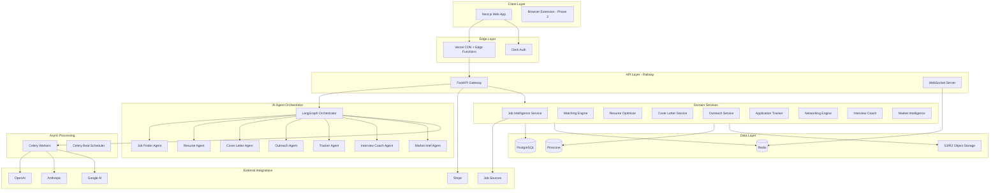
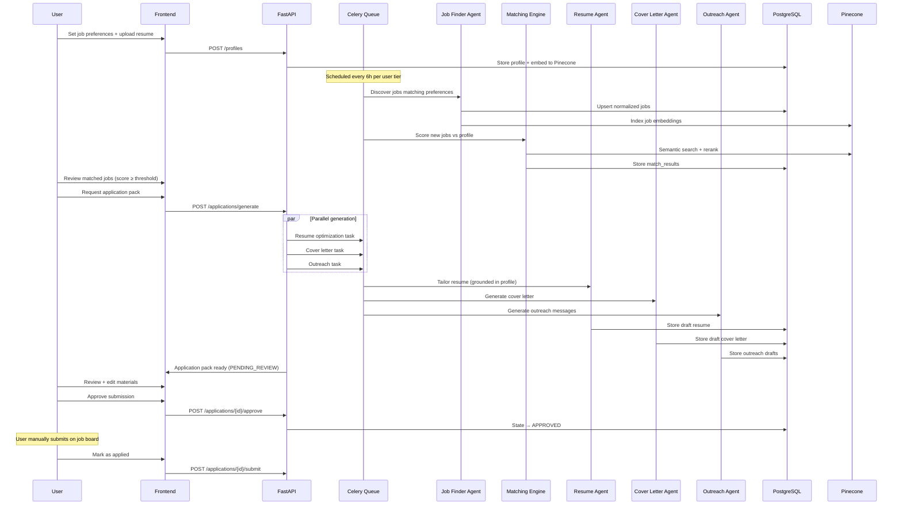
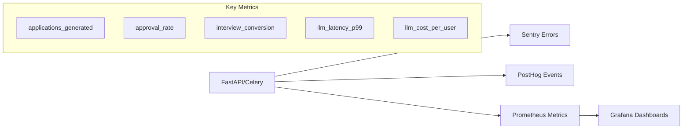

# ApplyPilot AI — System Architecture

**Version:** 1.0 | **Target Scale:** 100,000 MAU | **Last Updated:** June 2026

---

## 1. Executive Summary

ApplyPilot AI is a human-in-the-loop job application intelligence platform. It ingests jobs from 8+ sources, analyzes fit with multi-model LLMs, generates ATS-optimized application materials, and tracks outcomes—while **never submitting without explicit user approval**.

The architecture follows **event-driven microservices within a modular monolith** for MVP, with clear extraction boundaries for scale.

---

## 2. High-Level Architecture



---

## 3. Service Boundaries

### 3.1 Job Intelligence Service
- **Responsibility:** Ingest, normalize, deduplicate, enrich jobs
- **Inputs:** RSS, APIs, scraped career pages (respecting robots.txt), user-saved URLs
- **Outputs:** Normalized `Job` entities with intelligence scores
- **SLA:** Ingest latency < 5 min for scheduled sources; real-time for user-triggered

### 3.2 Matching Engine
- **Responsibility:** Profile ↔ Job fit scoring
- **Algorithm:** Hybrid — embedding similarity (Pinecone) + structured skill graph + LLM gap analysis
- **Output:** Match score (0-100), gap analysis JSON, interview probability

### 3.3 Application Material Generator
- **Resume Optimizer:** ATS-tailored resume variants (never fabricates experience)
- **Cover Letter Generator:** Company/role-specific narratives
- **Outreach Generator:** LinkedIn DM, email, follow-up, referral request

### 3.4 Human Approval Gateway
- **Critical invariant:** All submissions pass through `ApprovalQueue` state machine
- States: `DRAFT → PENDING_REVIEW → APPROVED → SUBMITTED | REJECTED`
- Audit log immutable in `approval_audit_log`

### 3.5 Application Tracker
- Kanban pipeline: Applied → OA → Interview → Rejected → Offer
- Webhook ingestion from email parsing (Phase 2)
- Manual status updates + AI-suggested transitions

---

## 4. Data Flow — Core Workflow



---

## 5. Technology Decisions

| Decision | Choice | Rationale |
|----------|--------|-----------|
| API framework | FastAPI | Async-native, OpenAPI auto-gen, Python AI ecosystem |
| Frontend | Next.js 15 App Router | SSR for SEO landing, RSC for dashboard performance |
| Auth | Clerk | SOC2, org support, webhooks for user sync |
| Primary DB | PostgreSQL 16 | JSONB for flexible job metadata, pgvector fallback |
| Cache/Queue | Redis 7 | Celery broker, rate limiting, session cache |
| Vector DB | Pinecone | Managed, metadata filtering, 100K+ vector scale |
| AI orchestration | LangGraph | Stateful agents, human-in-the-loop checkpoints |
| File storage | Cloudflare R2 | S3-compatible, no egress fees |
| Job processing | Celery + Beat | Proven async pattern, Railway-compatible |

---

## 6. Multi-Tenancy Model

```
Organization (optional, Teams tier)
  └── User (Clerk ID)
        └── Profile (resume, skills, preferences)
        └── Job Preferences (filters, sources, thresholds)
        └── Applications (linked to Job + generated materials)
        └── Subscription (Stripe)
```

- **Row-level security:** All queries scoped by `user_id` via middleware
- **Teams tier:** Shared job boards, admin approval workflows
- **Data isolation:** Separate S3 prefixes per user for documents

---

## 7. AI Model Routing Strategy

```python
# Model selection by task complexity & cost
TASK_MODEL_MAP = {
    "job_parsing": "gpt-4o-mini",           # Structured extraction
    "skill_extraction": "gpt-4o-mini",
    "match_scoring": "claude-3-5-sonnet",    # Nuanced reasoning
    "gap_analysis": "claude-3-5-sonnet",
    "resume_tailoring": "claude-3-5-sonnet", # Quality-critical
    "cover_letter": "claude-3-5-sonnet",
    "outreach": "gpt-4o-mini",
    "interview_prep": "claude-3-5-sonnet",
    "market_intel": "gemini-1.5-pro",        # Long context for reports
    "ats_scoring": "gpt-4o-mini",            # Fast iteration
}
```

**Fallback chain:** Primary → Secondary provider → Queue retry with exponential backoff

---

## 8. Scalability Architecture (100K Users)

### 8.1 Read/Write Split
- Primary PostgreSQL on Railway
- Read replica at 10K+ MAU
- Connection pooling via PgBouncer (max 100 connections per service)

### 8.2 Caching Layers
```
L1: Redis — hot job listings (TTL 1h), match scores (TTL 24h)
L2: CDN — static assets, generated PDF previews
L3: Application-level — memoized LLM responses (content-hash keyed)
```

### 8.3 Queue Partitioning
```
celery_queues:
  - critical: approval notifications, payment webhooks
  - ai_generation: resume, cover letter (concurrency limited)
  - job_ingestion: source polling (rate-limited per source)
  - analytics: PostHog event batching
```

### 8.4 Rate Limiting
| Resource | Free | Pro | Teams |
|----------|------|-----|-------|
| Jobs analyzed/day | 20 | 200 | 1000 |
| Applications generated/month | 5 | 50 | 200 |
| LLM tokens/month | 100K | 1M | 5M |

Enforced via Redis sliding window + Stripe subscription tier.

---

## 9. Observability



**North Star Metric:** Interview rate per approved application (target: 15%+ vs industry 2-5%)

---

## 10. Failure Modes & Resilience

| Failure | Mitigation |
|---------|------------|
| LLM provider outage | Multi-provider fallback; graceful degradation (queue jobs) |
| Job source blocked | Circuit breaker per source; user notification; manual URL import |
| Pinecone latency | pgvector fallback for match scoring |
| Database overload | Read replicas; query optimization; pagination enforced |
| Stripe webhook miss | Idempotent replay; daily reconciliation job |

---

## 11. Compliance & Ethics Architecture

1. **No auto-submission** — Enforced at API layer (`submit` requires `APPROVED` state + user JWT)
2. **No experience fabrication** — Resume agent constrained by RAG over user profile only
3. **Platform ToS** — Official APIs preferred; scraping limited to public career pages with rate limits
4. **GDPR/CCPA** — Data export API, 30-day deletion cascade, consent tracking
5. **Audit trail** — Every AI generation logged with prompt hash, model, input/output tokens

---

## 12. Deployment Topology

```
Production:
  Vercel (Frontend) ──HTTPS──► Railway (FastAPI + Celery Workers)
                                    │
                                    ├── Railway PostgreSQL
                                    ├── Railway Redis
                                    ├── Pinecone Cloud
                                    ├── Cloudflare R2
                                    └── External AI APIs

Staging: Identical topology, separate Railway project
```

---

## 13. Future Architecture (Post-MVP)

- **Browser extension:** Capture job URLs, autofill approved applications
- **Email integration:** Parse recruiter responses → auto-update tracker
- **Graph DB (Neo4j):** Networking relationship mapping
- **Dedicated matching microservice:** GPU embeddings at scale
- **Multi-region:** US + EU data residency
