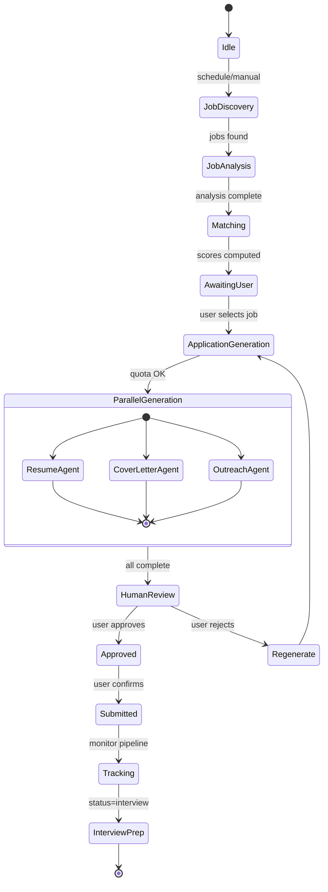

# ApplyPilot AI — AI Agent Architecture

**Orchestration Framework:** LangGraph  
**Pattern:** Supervisor + Specialized Workers with Human-in-the-Loop Checkpoints

---

## 1. Agent Overview

| Agent | Purpose | Trigger | Model | Avg Tokens |
|-------|---------|---------|-------|------------|
| Job Finder | Discover & normalize jobs | Scheduled / Manual | gpt-4o-mini | 2K |
| Resume Optimizer | ATS-tailor resume | User request | claude-3-5-sonnet | 8K |
| Cover Letter Generator | Personalized cover letter | User request | claude-3-5-sonnet | 4K |
| Recruiter Outreach | DM, email, follow-up | User request | gpt-4o-mini | 2K |
| Application Tracker | Status suggestions, reminders | Event-driven | gpt-4o-mini | 1K |
| Interview Coach | Mock interviews + feedback | User request | claude-3-5-sonnet | 6K |
| Market Intelligence | Salary, trends, company intel | Scheduled / Manual | gemini-1.5-pro | 15K |

---

## 2. Orchestrator State Machine



---

## 3. LangGraph Implementation

```python
# backend/app/agents/orchestrator.py

from langgraph.graph import StateGraph, END
from langgraph.checkpoint.postgres import PostgresSaver
from typing import TypedDict, Annotated
import operator

class AgentState(TypedDict):
    user_id: str
    job_id: str | None
    application_id: str | None
    profile_context: dict          # RAG-retrieved profile chunks
    job_context: dict              # Parsed job analysis
    resume_draft: str | None
    cover_letter_draft: str | None
    outreach_drafts: list[dict]
    ats_score: int | None
    errors: Annotated[list[str], operator.add]
    current_step: str
    requires_human_approval: bool

def build_application_graph() -> StateGraph:
    graph = StateGraph(AgentState)
    
    graph.add_node("retrieve_context", retrieve_rag_context)
    graph.add_node("optimize_resume", resume_optimizer.run)
    graph.add_node("generate_cover_letter", cover_letter.run)
    graph.add_node("generate_outreach", recruiter_outreach.run)
    graph.add_node("score_ats", ats_analyzer.run)
    graph.add_node("human_review", human_review_checkpoint)
    graph.add_node("finalize", finalize_application)
    
    graph.set_entry_point("retrieve_context")
    
    graph.add_edge("retrieve_context", "optimize_resume")
    graph.add_edge("retrieve_context", "generate_cover_letter")
    graph.add_edge("retrieve_context", "generate_outreach")
    
    graph.add_edge("optimize_resume", "score_ats")
    graph.add_edge("generate_cover_letter", "score_ats")
    graph.add_edge("generate_outreach", "score_ats")
    
    graph.add_conditional_edges(
        "score_ats",
        lambda s: "human_review" if s["ats_score"] >= 70 else "optimize_resume",
        {"human_review": "human_review", "optimize_resume": "optimize_resume"}
    )
    
    graph.add_edge("human_review", "finalize")
    graph.add_edge("finalize", END)
    
    checkpointer = PostgresSaver.from_conn_string(settings.DATABASE_URL)
    return graph.compile(checkpointer=checkpointer, interrupt_before=["human_review"])
```

---

## 4. Individual Agent Specifications

### Agent 1: Job Finder

**Input:** User preferences, enabled sources, last cursor per source  
**Output:** Normalized `Job` records + Pinecone embeddings

```python
class JobFinderAgent(BaseAgent):
    agent_type = AgentType.JOB_FINDER
    
    async def run(self, state: AgentState) -> AgentState:
        sources = self.get_enabled_sources(state["user_id"])
        jobs = []
        
        for source in sources:
            async with self.circuit_breaker(source.name):
                raw_jobs = await source.fetch(state["preferences"])
                for raw in raw_jobs:
                    normalized = await self.normalize(raw)
                    if not await self.is_duplicate(normalized):
                        analyzed = await self.analyze_jd(normalized)
                        jobs.append(analyzed)
        
        await self.index_to_pinecone(jobs)
        await self.store_jobs(jobs)
        return state
```

**Source Adapters:**
| Source | Method | Rate Limit |
|--------|--------|------------|
| LinkedIn | RapidAPI / Official Jobs API | 100 req/day |
| Wellfound | GraphQL API | 50 req/min |
| RemoteOK | Public JSON API | Unlimited |
| Indeed | Publisher API | 100 req/day |
| Naukri | Scraper (robots.txt compliant) | 10 req/min |
| Instahyre | Authenticated API | 30 req/min |
| YC Jobs | Work at a Startup API | 20 req/min |
| Career Pages | Custom scraper per domain | 5 req/min/domain |

---

### Agent 2: Resume Optimizer

**Constraints (non-negotiable):**
1. NEVER add experience not in user profile
2. MAY reorder, rephrase, emphasize relevant achievements
3. MAY add keywords naturally into existing bullet points
4. MUST preserve factual accuracy (dates, companies, titles)

**Pipeline:**
```
Profile RAG → Identify relevant experiences → 
Tailor bullet points → Inject JD keywords → 
ATS format (single column, standard fonts) → 
Score ≥ 70 or retry (max 3 iterations)
```

---

### Agent 3: Cover Letter Generator

**Structure enforced via prompt:**
1. Hook — specific to company (NOT "I am excited to apply")
2. Relevance bridge — 2 achievements mapped to JD requirements
3. Company knowledge — product/mission reference from RAG
4. Close — confident, specific call to action

**Max length:** 350 words (recruiter attention span)

---

### Agent 4: Recruiter Outreach Agent

**Generates 4 message types per application:**

| Channel | Max Length | Tone |
|---------|------------|------|
| LinkedIn DM | 300 chars | Conversational, peer-level |
| Email | 150 words | Professional, value-first |
| Follow-up | 100 words | Brief, non-desperate |
| Referral request | 200 words | Warm, specific ask |

**Personalization inputs:** Recipient title, mutual connections, company news (RAG)

---

### Agent 5: Application Tracker

**Event-driven triggers:**
- 7 days post-submit with no response → suggest follow-up
- Status change to OA → generate prep checklist
- Status change to Interview → trigger Interview Coach
- 14 days in Applied → suggest status check

---

### Agent 6: Interview Coach

**Session flow:**
```
1. Load job + company context
2. Generate 5-8 role-specific questions (behavioral + technical mix)
3. User submits written/spoken answer
4. AI scores on: STAR structure, specificity, relevance
5. Provide improved answer example
6. Track improvement over sessions
```

---

### Agent 7: Market Intelligence Agent

**Report types:**
- **Role Market:** Demand trend, top skills, salary range (P50/P75/P90)
- **Company Intel:** Funding, layoffs, hiring velocity, culture signals
- **Competitive Landscape:** Applicant pool analysis for target role

**Data sources:** Internal job DB + public APIs (Crunchbase, Levels.fyi estimates)

---

## 5. Agent Communication Protocol

```python
@dataclass
class AgentMessage:
    agent_type: AgentType
    correlation_id: str          # Links parallel agent runs
    user_id: str
    payload: dict
    priority: int = 5            # 1=critical, 10=background
    
@dataclass  
class AgentResult:
    agent_type: AgentType
    correlation_id: str
    success: bool
    output: dict
    tokens_used: int
    cost_usd: float
    latency_ms: int
    prompt_version: str
```

---

## 6. Error Handling & Retries

```python
AGENT_RETRY_CONFIG = {
    "max_retries": 3,
    "backoff_base": 2,           # seconds
    "backoff_max": 60,
    "retryable_errors": [
        "RateLimitError",
        "ServiceUnavailableError", 
        "TimeoutError",
    ],
    "fallback_models": {
        "claude-3-5-sonnet": "gpt-4o",
        "gpt-4o-mini": "gemini-1.5-flash",
    }
}
```

---

## 7. Cost Controls Per Agent Run

```python
async def enforce_token_budget(user_id: str, estimated_tokens: int):
    quota = await quota_service.get_remaining(user_id)
    if estimated_tokens > quota.llm_tokens_remaining:
        raise QuotaExceededError(
            f"Need {estimated_tokens} tokens, {quota.llm_tokens_remaining} remaining"
        )
```

**Estimated cost per application pack:** $0.15 - $0.35 (Pro tier profitable at $29/mo with 50 apps)

---

## 8. Observability Per Agent

Every run logs to `agent_runs` table:
- Input/output payloads (PII redacted)
- Model, prompt version, token counts
- Latency, cost, success/failure
- Correlation ID for distributed tracing

**PostHog events:**
- `agent_started`, `agent_completed`, `agent_failed`
- `human_approval_granted`, `human_approval_rejected`
- `application_submitted`

---

## 9. Testing Strategy

| Test Type | Scope |
|-----------|-------|
| Unit | Individual agent prompt rendering, output parsing |
| Integration | Full graph execution with mocked LLM |
| Eval | Resume quality scored by human raters (weekly) |
| Regression | Golden dataset of 50 JDs with expected extractions |
| Load | 100 concurrent application generations |

**Eval metrics:**
- Skill extraction F1 ≥ 0.85
- Resume ATS score improvement ≥ 15 points vs original
- Cover letter human rating ≥ 4.0/5.0
- Zero hallucinated experience (hard fail)
