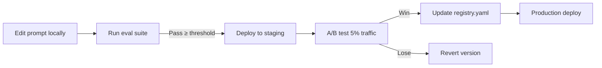

# ApplyPilot AI — Prompt Engineering System

**Version:** 1.0 | **Template Engine:** Jinja2 | **Registry:** Git + PostgreSQL

---

## 1. Design Principles

1. **Version everything** — Every prompt has semver; never mutate in production
2. **Separate system from user content** — System prompts in repo; user data injected at runtime
3. **Structured outputs** — All extraction prompts return JSON via function calling
4. **Grounding constraints** — Explicit "do not fabricate" rules in every generation prompt
5. **Eval-driven iteration** — Prompt changes require eval pass before promotion

---

## 2. Prompt Registry Architecture

```
prompts/
├── registry.yaml              # Maps agent → active version
├── _shared/
│   ├── system_identity.jinja2 # Base AI persona
│   └── output_formats.jinja2  # JSON schemas
└── {agent_name}/
    └── v{version}/
        └── {prompt_name}.jinja2
```

### registry.yaml

```yaml
agents:
  job_finder:
    parse_jd: "1.0.0"
    extract_skills: "1.0.0"
  resume_optimizer:
    tailor_resume: "1.0.0"
    ats_score: "1.0.0"
  cover_letter:
    generate: "1.0.0"
  outreach:
    linkedin_dm: "1.0.0"
    email: "1.0.0"
    follow_up: "1.0.0"
    referral_request: "1.0.0"
  matching:
    score_match: "1.0.0"
    gap_analysis: "1.0.0"
  interview_coach:
    mock_interview: "1.0.0"
    feedback: "1.0.0"
  market_intelligence:
    role_report: "1.0.0"
```

---

## 3. Prompt Manager Implementation

```python
# backend/app/ai/prompt_manager.py

from jinja2 import Environment, FileSystemLoader, select_autoescape
from pathlib import Path
import yaml

class PromptManager:
    def __init__(self, prompts_dir: Path = Path("prompts")):
        self.env = Environment(
            loader=FileSystemLoader(prompts_dir),
            autoescape=select_autoescape(["jinja2"]),
            trim_blocks=True,
            lstrip_blocks=True,
        )
        with open(prompts_dir / "registry.yaml") as f:
            self.registry = yaml.safe_load(f)
    
    def render(self, agent: str, prompt_name: str, **variables) -> tuple[str, str]:
        version = self.registry["agents"][agent][prompt_name]
        template_path = f"{agent}/v{version}/{prompt_name}.jinja2"
        template = self.env.get_template(template_path)
        rendered = template.render(**variables)
        return rendered, version
    
    def get_model_config(self, agent: str, prompt_name: str) -> dict:
        version = self.registry["agents"][agent][prompt_name]
        config_path = f"{agent}/v{version}/config.yaml"
        # temperature, max_tokens, response_format
        ...
```

---

## 4. Core Prompt Templates

### 4.1 Shared System Identity

```jinja2
{# prompts/_shared/system_identity.jinja2 #}
You are ApplyPilot AI, an expert career coach and application strategist.

CORE RULES (NEVER VIOLATE):
1. NEVER fabricate experience, skills, education, or achievements
2. ONLY use information explicitly provided in the user's profile
3. Rephrase and emphasize existing content — do not invent
4. Write like a top candidate: confident, specific, quantified
5. Optimize for ATS parsing AND human readability
6. Avoid clichés: "passionate", "excited to apply", "team player"
7. Use strong action verbs and quantified achievements

OUTPUT LANGUAGE: {{ language | default('English') }}
```

### 4.2 Job Description Parser

```jinja2
{# prompts/job_finder/v1.0.0/parse_jd.jinja2 #}


Analyze this job description and extract structured intelligence.

<job_description>
{{ job_description }}
</job_description>

Return JSON with this exact schema:
{
  "required_skills": ["skill1", "skill2"],
  "preferred_skills": ["skill1"],
  "experience_years_min": 3,
  "experience_years_max": 5,
  "responsibilities": ["resp1", "resp2"],
  "hidden_requirements": [
    {"requirement": "Startup pace tolerance", "signal": "wear many hats"}
  ],
  "seniority_level": "senior",
  "company_type": "series_b_startup",
  "keywords": ["keyword1"],
  "red_flags": [],
  "employment_type": "full_time",
  "remote_policy": "hybrid"
}

Rules:
- hidden_requirements: infer from tone/context, not explicitly stated
- keywords: ATS-relevant terms recruiters filter on
- red_flags: unrealistic requirements, bait-and-switch signals
```

### 4.3 Match Scoring

```jinja2
{# prompts/matching/v1.0.0/score_match.jinja2 #}


Score how well this candidate matches this role.

<candidate_profile>
{{ profile_summary }}
</candidate_profile>

<job_analysis>
{{ job_analysis_json }}
</job_analysis>

Return JSON:
{
  "match_score": 78,
  "skill_match": {
    "matched": ["Python", "AWS"],
    "missing": ["Kubernetes"],
    "transferable": [{"from": "Docker", "to": "Kubernetes", "confidence": 0.7}]
  },
  "gap_analysis": {
    "critical_gaps": ["No K8s production experience"],
    "minor_gaps": ["No fintech domain"],
    "strengths": ["Strong backend scaling experience"],
    "mitigation_suggestions": ["Highlight Docker orchestration experience"]
  },
  "interview_probability": {
    "shortlist": 0.65,
    "oa": 0.45,
    "interview": 0.30
  },
  "recommendation": "apply",
  "reasoning": "Strong backend match with minor infra gap..."
}

Scoring rubric:
- 90-100: Exceptional fit, likely fast-track
- 75-89: Strong fit, worth applying
- 60-74: Moderate fit, gaps addressable in cover letter
- 40-59: Stretch role, low probability
- 0-39: Poor fit, recommend skip
```

### 4.4 Resume Tailoring

```jinja2
{# prompts/resume_optimizer/v1.0.0/tailor_resume.jinja2 #}


Tailor this resume for the target role. REPHRASE only — never add fake experience.

<original_profile>
{{ profile_json }}
</original_profile>

<target_job>
Title: {{ job_title }}
Company: {{ company_name }}
Required Skills: {{ required_skills | join(', ') }}
Key Responsibilities: {{ responsibilities | join('; ') }}
ATS Keywords: {{ keywords | join(', ') }}
</target_job>

<relevant_experiences>
{# RAG-retrieved, ranked by relevance #}

- {{ exp.company }} | {{ exp.title }} | {{ exp.achievements | join('; ') }}

</relevant_experiences>

Instructions:
1. Rewrite summary to mirror role requirements (2-3 sentences)
2. Reorder experiences by relevance to this role
3. Rewrite bullet points: lead with impact, inject keywords naturally
4. Customize project descriptions to highlight relevant tech
5. Keep to 1 page if <10 years experience, 2 pages max
6. Use standard section headers: Summary, Experience, Skills, Education, Projects

Return JSON:
{
  "tailored_resume_text": "...",
  "changes_made": ["Rewrote summary", "Reordered experiences"],
  "keywords_injected": ["Python", "microservices"],
  "sections_modified": ["summary", "experience", "skills"]
}
```

### 4.5 Cover Letter

```jinja2
{# prompts/cover_letter/v1.0.0/generate.jinja2 #}


Write a cover letter that sounds like a top candidate wrote it personally.

<candidate>
{{ candidate_name }} — {{ current_title }} at {{ current_company }}
Key achievements: {{ top_achievements | join('; ') }}
</candidate>

<role>
{{ job_title }} at {{ company_name }}
{{ company_description }}
</role>

<job_requirements>
{{ top_requirements | join('\n') }}
</job_requirements>

<company_context>
{# RAG from company research #}
{{ company_news }}
</company_context>

Structure (max 350 words):
1. Opening hook — reference something specific about the company (NOT generic excitement)
2. Bridge — connect 2 specific achievements to 2 job requirements with metrics
3. Company fit — show you understand their product/mission/challenge
4. Close — confident, specific next step

Tone: {{ tone | default('professional but human') }}

Return JSON:
{
  "cover_letter_text": "...",
  "word_count": 280,
  "company_references": ["Reference to their recent product launch"],
  "achievements_highlighted": ["Scaled API to 10M req/day"]
}
```

### 4.6 LinkedIn DM

```jinja2
{# prompts/outreach/v1.0.0/linkedin_dm.jinja2 #}
Write a LinkedIn connection message to a {{ recipient_title }} at {{ company_name }}.

Context: Applying for {{ job_title }}. Candidate has {{ years_experience }} years in {{ domain }}.

Rules:
- MAX 300 characters (LinkedIn limit for connection requests)
- No "I'd love to pick your brain"
- Lead with value or specific shared interest
- One clear, low-friction ask

Return JSON: {"message": "...", "char_count": 280}
```

---

## 5. Output Parsing & Validation

```python
# backend/app/ai/output_parser.py

from pydantic import BaseModel, ValidationError
import json

class MatchScoreOutput(BaseModel):
    match_score: int
    skill_match: dict
    gap_analysis: dict
    interview_probability: dict
    recommendation: str
    reasoning: str

def parse_llm_json(raw: str, schema: type[BaseModel]) -> BaseModel:
    # Strip markdown fences if present
    cleaned = raw.strip()
    if cleaned.startswith("```"):
        cleaned = cleaned.split("\n", 1)[1].rsplit("```", 1)[0]
    
    data = json.loads(cleaned)
    return schema.model_validate(data)
```

---

## 6. Prompt Versioning Workflow



**Promotion criteria:**
- Eval F1 score ≥ previous version
- Zero hallucination failures
- Human rating ≥ 4.0/5.0 on sample of 20 outputs
- Latency within 10% of previous version

---

## 7. A/B Testing Framework

```python
async def get_prompt_version(agent: str, prompt_name: str, user_id: str) -> str:
    experiment = await experiments.get_active(f"{agent}.{prompt_name}")
    if experiment and hash(user_id) % 100 < experiment.traffic_pct:
        return experiment.variant_version
    return registry["agents"][agent][prompt_name]
```

---

## 8. Anti-Hallucination Guardrails

```python
HALLUCINATION_CHECKS = [
    "verify_companies_exist",      # All companies in output ⊆ profile companies
    "verify_dates_consistent",     # No date conflicts introduced
    "verify_skills_sourced",       # Skills ⊆ profile skills + JD keywords
    "verify_no_new_degrees",       # Education unchanged
    "verify_metrics_plausible",    # Flag new numbers not in profile
]

async def validate_resume_output(original: Profile, tailored: str) -> ValidationResult:
    for check in HALLUCINATION_CHECKS:
        result = await CHECKS[check](original, tailored)
        if not result.passed:
            return ValidationResult(passed=False, reason=result.reason)
    return ValidationResult(passed=True)
```

---

## 9. Token Optimization

| Technique | Savings |
|-----------|---------|
| Profile summarization for matching | 40% |
| JD truncation to relevant sections | 30% |
| Cached extractions (same JD hash) | 60% on duplicates |
| gpt-4o-mini for extraction tasks | 80% vs gpt-4o |

**Cache key:** `SHA256(prompt_version + input_hash)` → Redis TTL 7 days
