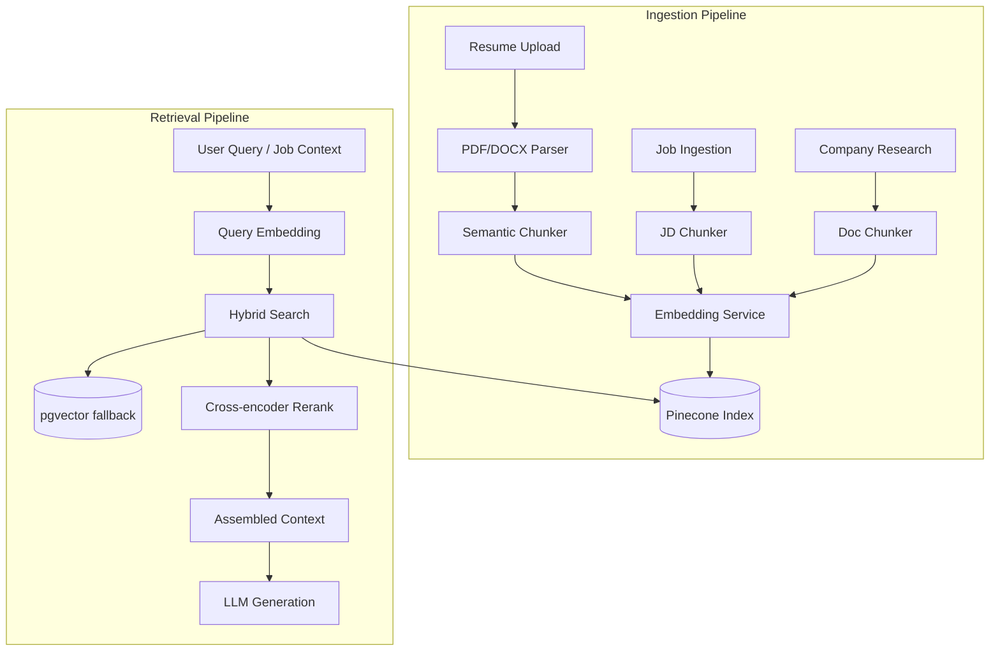

# ApplyPilot AI — RAG Implementation

**Vector Store:** Pinecone | **Embeddings:** OpenAI text-embedding-3-small | **Fallback:** pgvector

---

## 1. RAG Use Cases

| Use Case | Indexed Content | Query | Retrieved For |
|----------|----------------|-------|---------------|
| Profile matching | User resume chunks | Job embedding | Match scoring |
| Resume tailoring | Experience + project chunks | Job requirements | Relevant bullets to emphasize |
| Cover letter | Company research + profile | Job + company | Personalization |
| Job dedup | Job description embeddings | New job embedding | Duplicate detection |
| Interview prep | JD + company docs | Question topic | Context-aware questions |

---

## 2. Architecture



---

## 3. Pinecone Index Design

```python
# Index configuration
INDEX_CONFIG = {
    "name": "applypilot-production",
    "dimension": 1536,                    # text-embedding-3-small
    "metric": "cosine",
    "spec": {
        "serverless": {
            "cloud": "aws",
            "region": "us-east-1"
        }
    }
}

# Namespace strategy (multi-tenant isolation)
NAMESPACES = {
    "profiles": "user-profile-chunks",    # metadata.user_id required
    "jobs": "job-descriptions",           # shared across users
    "companies": "company-intelligence",  # shared
}
```

### Vector Metadata Schema

```python
# Profile chunk metadata
{
    "id": "prof_{user_id}_{chunk_idx}",
    "values": [0.1, 0.2, ...],           # 1536-dim
    "metadata": {
        "user_id": "uuid",
        "chunk_type": "experience",       # experience | project | skill | education | summary
        "source_id": "exp_uuid",          # FK to profile_experiences
        "company": "Google",
        "title": "Senior Engineer",
        "text": "Led team of 5...",       # Stored for retrieval (max 1000 chars)
        "technologies": ["Python", "K8s"],
        "date_range": "2020-2024",
        "created_at": "2026-06-01T00:00:00Z"
    }
}

# Job metadata
{
    "id": "job_{job_id}",
    "metadata": {
        "job_id": "uuid",
        "company_name": "Stripe",
        "title": "Backend Engineer",
        "required_skills": ["Python", "PostgreSQL"],
        "source": "linkedin",
        "is_active": True,
        "posted_at": "2026-06-01"
    }
}
```

---

## 4. Chunking Strategy

```python
# backend/app/ai/rag/chunker.py

from dataclasses import dataclass

@dataclass
class ChunkConfig:
    max_tokens: int = 512
    overlap_tokens: int = 50
    min_chunk_tokens: int = 100

class ProfileChunker:
    """Semantic chunking — one chunk per logical unit, not arbitrary splits."""
    
    def chunk_profile(self, profile: Profile) -> list[DocumentChunk]:
        chunks = []
        
        # Summary = 1 chunk
        if profile.summary:
            chunks.append(Chunk(type="summary", text=profile.summary))
        
        # Each experience = 1 chunk (achievements concatenated)
        for exp in profile.experiences:
            text = f"{exp.title} at {exp.company}\n"
            text += "\n".join(f"• {a}" for a in exp.achievements)
            text += f"\nTechnologies: {', '.join(exp.technologies)}"
            chunks.append(Chunk(type="experience", text=text, source_id=exp.id))
        
        # Each project = 1 chunk
        for proj in profile.projects:
            chunks.append(Chunk(type="project", text=proj.description, source_id=proj.id))
        
        # Skills grouped by category
        chunks.append(Chunk(type="skills", text=self._format_skills(profile.skills)))
        
        return chunks

class JobChunker:
    def chunk_jd(self, job: Job) -> list[DocumentChunk]:
        # Keep JD as single chunk for most jobs (<4000 tokens)
        # Split only if >3000 tokens, by section headers
        if len(job.description) < 3000:
            return [Chunk(type="full_jd", text=job.description)]
        return self._split_by_sections(job.description)
```

---

## 5. Embedding Service

```python
# backend/app/ai/rag/embeddings.py

from openai import AsyncOpenAI

class EmbeddingService:
    MODEL = "text-embedding-3-small"
    DIMENSIONS = 1536
    BATCH_SIZE = 100
    
    def __init__(self):
        self.client = AsyncOpenAI()
        self.cache = RedisCache(prefix="emb:", ttl=86400 * 7)
    
    async def embed_texts(self, texts: list[str]) -> list[list[float]]:
        # Check cache first
        results = []
        uncached = []
        uncached_indices = []
        
        for i, text in enumerate(texts):
            cache_key = hashlib.sha256(text.encode()).hexdigest()
            cached = await self.cache.get(cache_key)
            if cached:
                results.append(cached)
            else:
                uncached.append(text)
                uncached_indices.append(i)
                results.append(None)
        
        if uncached:
            response = await self.client.embeddings.create(
                model=self.MODEL,
                input=uncached,
                dimensions=self.DIMENSIONS,
            )
            for j, embedding in enumerate(response.data):
                idx = uncached_indices[j]
                results[idx] = embedding.embedding
                await self.cache.set(
                    hashlib.sha256(uncached[j].encode()).hexdigest(),
                    embedding.embedding
                )
        
        return results
```

---

## 6. Hybrid Retriever

```python
# backend/app/ai/rag/retriever.py

class HybridRetriever:
    """
    Combines vector search + metadata filtering + BM25 keyword search.
    """
    
    async def retrieve_for_resume_tailoring(
        self,
        user_id: str,
        job: Job,
        top_k: int = 8,
    ) -> list[RetrievedChunk]:
        # 1. Embed job requirements
        query_text = f"{job.title}\n{', '.join(job.required_skills)}\n{job.description[:1000]}"
        query_embedding = (await self.embedder.embed_texts([query_text]))[0]
        
        # 2. Vector search in user's profile namespace
        vector_results = await self.pinecone.query(
            namespace="profiles",
            vector=query_embedding,
            top_k=top_k * 2,  # Over-fetch for reranking
            filter={"user_id": {"$eq": user_id}},
            include_metadata=True,
        )
        
        # 3. Keyword boost — experiences mentioning required skills
        keyword_results = await self._keyword_search(
            user_id=user_id,
            keywords=job.required_skills,
            limit=top_k,
        )
        
        # 4. Merge and deduplicate
        merged = self._merge_results(vector_results, keyword_results)
        
        # 5. Rerank with cross-encoder (optional, for quality)
        reranked = await self._rerank(query_text, merged, top_k=top_k)
        
        return reranked
    
    async def find_similar_jobs(
        self,
        job_id: str,
        top_k: int = 5,
    ) -> list[str]:
        """Used for deduplication and 'similar roles' feature."""
        job_vector = await self.pinecone.fetch(ids=[f"job_{job_id}"])
        results = await self.pinecone.query(
            namespace="jobs",
            vector=job_vector.vectors[f"job_{job_id}"].values,
            top_k=top_k,
            filter={"is_active": {"$eq": True}},
        )
        return [r.metadata["job_id"] for r in results if r.score > 0.92]
```

---

## 7. Indexing Pipeline

```python
# backend/app/ai/rag/indexer.py

class ProfileIndexer:
    async def index_profile(self, user_id: str, profile: Profile):
        # 1. Delete existing vectors for user
        await self.pinecone.delete(
            namespace="profiles",
            filter={"user_id": {"$eq": user_id}},
        )
        
        # 2. Chunk profile
        chunks = ProfileChunker().chunk_profile(profile)
        
        # 3. Embed all chunks
        texts = [c.text for c in chunks]
        embeddings = await self.embedder.embed_texts(texts)
        
        # 4. Upsert to Pinecone
        vectors = []
        for i, (chunk, embedding) in enumerate(zip(chunks, embeddings)):
            vectors.append({
                "id": f"prof_{user_id}_{i}",
                "values": embedding,
                "metadata": {
                    "user_id": user_id,
                    "chunk_type": chunk.type,
                    "source_id": str(chunk.source_id or ""),
                    "text": chunk.text[:1000],
                    **chunk.extra_metadata,
                }
            })
        
        await self.pinecone.upsert(namespace="profiles", vectors=vectors)
        
        # 5. Update profile.embedding_id reference
        await self.db.update_profile(user_id, embedding_id=f"prof_{user_id}_0")

class JobIndexer:
    async def index_job(self, job: Job):
        embedding = (await self.embedder.embed_texts([job.description]))[0]
        await self.pinecone.upsert(
            namespace="jobs",
            vectors=[{
                "id": f"job_{job.id}",
                "values": embedding,
                "metadata": {
                    "job_id": str(job.id),
                    "company_name": job.company_name,
                    "title": job.title,
                    "required_skills": job.required_skills,
                    "is_active": job.is_active,
                }
            }]
        )
```

---

## 8. pgvector Fallback

```sql
-- Fallback table when Pinecone unavailable
CREATE TABLE vector_embeddings (
    id UUID PRIMARY KEY DEFAULT uuid_generate_v4(),
    entity_type VARCHAR(50) NOT NULL,  -- profile_chunk, job
    entity_id UUID NOT NULL,
    user_id UUID,                       -- NULL for shared entities
    embedding vector(1536) NOT NULL,
    metadata JSONB DEFAULT '{}',
    created_at TIMESTAMPTZ DEFAULT NOW()
);

CREATE INDEX idx_vector_embedding ON vector_embeddings 
    USING ivfflat (embedding vector_cosine_ops) WITH (lists = 100);
```

```python
async def pgvector_search(query_embedding, user_id, top_k=8):
    query = """
        SELECT entity_id, metadata, 
               1 - (embedding <=> :query_vec) AS similarity
        FROM vector_embeddings
        WHERE user_id = :user_id
        ORDER BY embedding <=> :query_vec
        LIMIT :top_k
    """
    return await db.fetch_all(query, {"query_vec": query_embedding, "user_id": user_id, "top_k": top_k})
```

---

## 9. Context Assembly for LLM

```python
def assemble_rag_context(chunks: list[RetrievedChunk], max_tokens: int = 4000) -> str:
    """Build context string within token budget, highest relevance first."""
    context_parts = []
    token_count = 0
    
    for chunk in sorted(chunks, key=lambda c: c.score, reverse=True):
        chunk_tokens = count_tokens(chunk.text)
        if token_count + chunk_tokens > max_tokens:
            break
        context_parts.append(
            f"[{chunk.metadata['chunk_type'].upper()} — "
            f"relevance: {chunk.score:.2f}]\n{chunk.text}"
        )
        token_count += chunk_tokens
    
    return "\n\n---\n\n".join(context_parts)
```

---

## 10. Performance & Cost

| Operation | Latency Target | Cost |
|-----------|---------------|------|
| Profile indexing (full) | < 3s | ~$0.001 |
| Job indexing | < 1s | ~$0.0005 |
| Retrieval query | < 200ms | ~$0.0001 |
| Batch re-index (100K profiles) | Background job | ~$100 one-time |

**Pinecone pricing at 100K users:**
- ~500K profile vectors + ~2M job vectors
- Serverless: ~$70-150/month at scale

---

## 11. Data Lifecycle

| Event | Action |
|-------|--------|
| Profile updated | Re-index all profile chunks |
| Job ingested | Index once, update on re-parse |
| Job deactivated | Set `is_active=false` in metadata |
| User deleted | Delete all vectors where `user_id` matches |
| Company updated | Re-index company intelligence docs |
