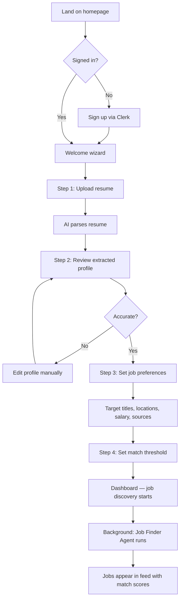
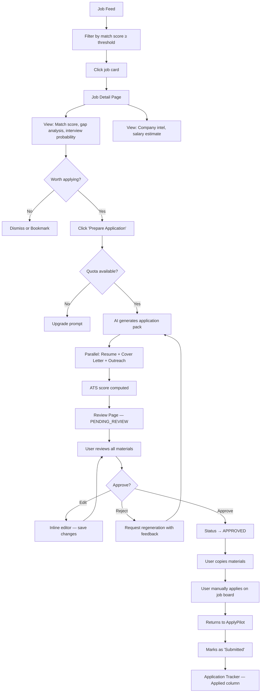
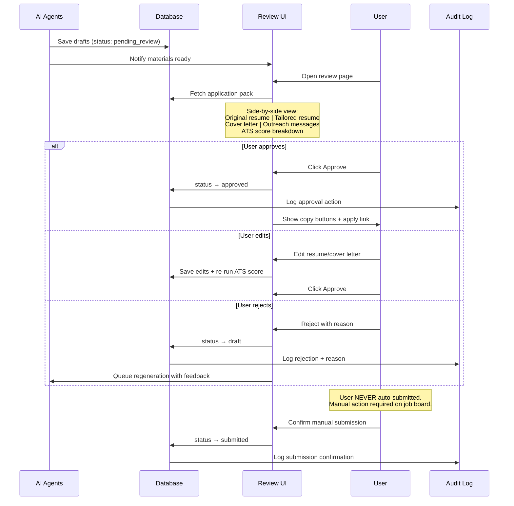
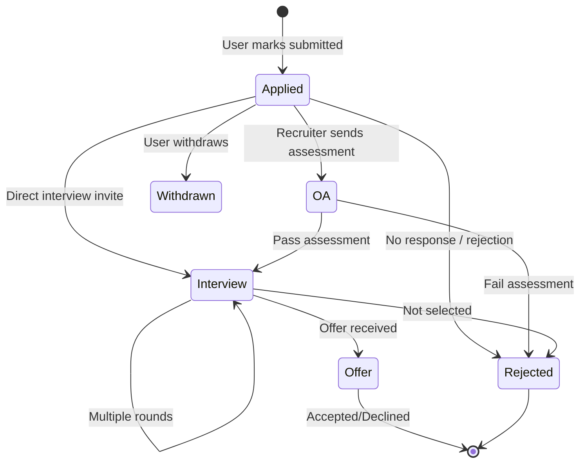
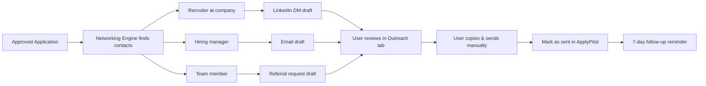
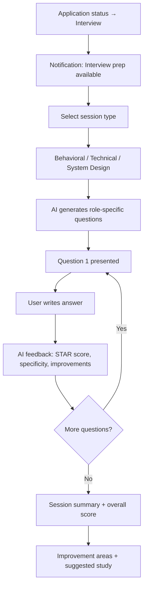
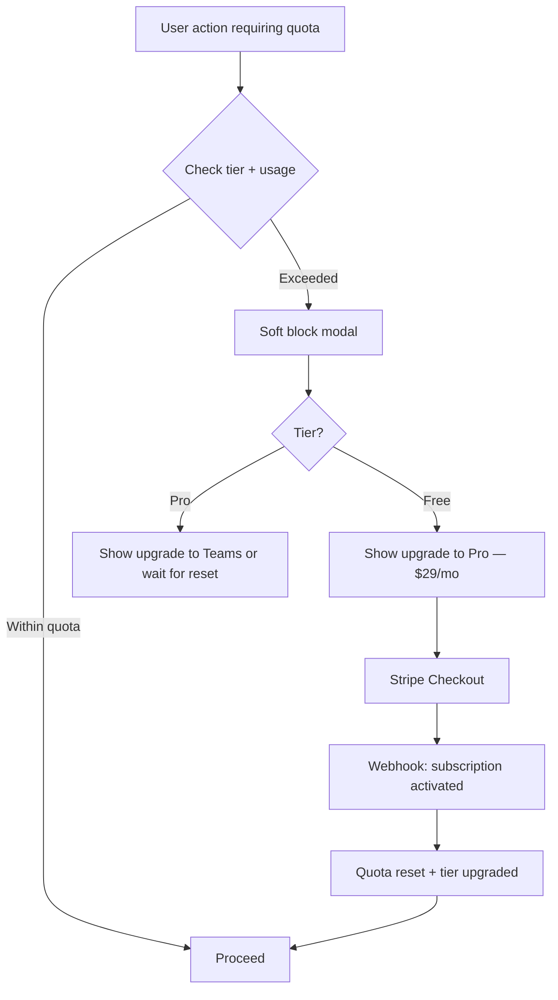
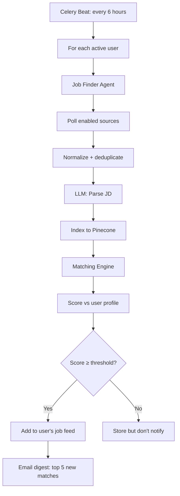

# ApplyPilot AI — User Flow Diagrams

---

## 1. Onboarding Flow



**Time to value:** < 5 minutes from signup to first matched jobs

---

## 2. Core Application Flow



---

## 3. Human Approval Gate (Critical Path)



---

## 4. Application Tracker Flow



**AI-assisted transitions:**
- 7 days in Applied → AI suggests follow-up outreach
- Moved to OA → AI generates prep checklist
- Moved to Interview → AI triggers Interview Coach

---

## 5. Outreach Flow



---

## 6. Interview Prep Flow



---

## 7. Subscription & Quota Flow



---

## 8. Job Discovery Flow (Background)



---

## 9. Information Architecture (Navigation)

```
Dashboard
├── Overview (stats, recent activity, top matches)
├── Jobs
│   ├── Feed (matched jobs)
│   ├── Saved
│   └── Import URL
├── Applications
│   ├── Kanban Board
│   └── [Application Detail]
│       ├── Materials
│       ├── Review & Approve
│       └── Outreach
├── Profile
│   ├── Resume & Experience
│   ├── Skills
│   └── Preferences
├── Interview Prep
├── Analytics
│   ├── Application stats
│   └── Market reports
└── Settings
    ├── Account
    ├── Notifications
    └── Billing
```

---

## 10. Mobile-Responsive Priorities

| Screen | Mobile Priority | Desktop Enhancement |
|--------|----------------|---------------------|
| Job feed | Card stack, swipe dismiss | Table + filters |
| Review page | Tabbed materials | Side-by-side diff |
| Tracker | Vertical pipeline | Kanban board |
| Profile | Step wizard | Full form |
