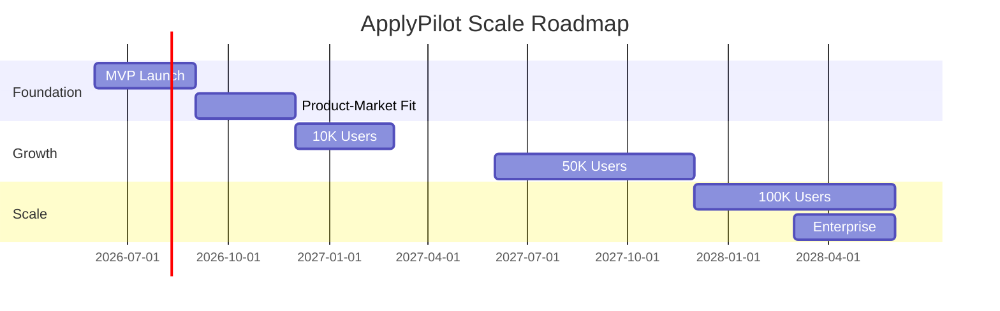
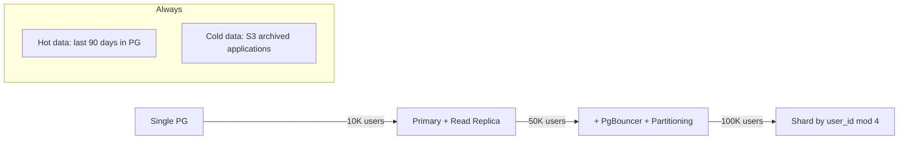

# ApplyPilot AI — Scale Roadmap (100K Users)

**Timeline:** Month 4 → Month 24 | **Target:** 100,000 MAU, $2M ARR

---

## Scale Phases

---

## Phase 1: Product-Market Fit (Month 4-6, 1K-5K users)

### Engineering
- [ ] Add remaining job sources (LinkedIn, Naukri, Instahyre, career pages)
- [ ] Advanced matching model (train on outcome data)
- [ ] Referral request outreach
- [ ] Market intelligence reports
- [ ] Networking engine v1 (contact discovery)
- [ ] Read replica for PostgreSQL
- [ ] PgBouncer connection pooling

### Product
- [ ] Teams tier launch (shared boards, admin controls)
- [ ] Outcome tracking (did you get an interview?)
- [ ] Resume A/B testing (which version performs better)

### Infrastructure
- Current: Single Railway service
- Target: Separate Celery worker dynos (2x generation, 1x ingestion)

**Cost at 5K users:** ~$2,500/month infra + $3,000/month LLM

---

## Phase 2: Growth Engine (Month 7-12, 5K-25K users)

### Engineering
- [ ] Browser extension (Chrome) — capture jobs, autofill approved apps
- [ ] Email integration — parse recruiter responses → auto-update tracker
- [ ] Voice interview coach (Whisper + TTS)
- [ ] Multi-language support (Hindi for Naukri users)
- [ ] Advanced analytics (cohort analysis, funnel optimization)
- [ ] API rate limiting per source with global coordination
- [ ] LLM response caching layer (Redis, content-hash keyed)

### Infrastructure
- [ ] Multi-region deployment (US-East primary, US-West replica)
- [ ] CDN for generated PDF resumes (Cloudflare R2)
- [ ] Dedicated matching microservice
- [ ] Kubernetes migration (Railway → EKS/GKE at 25K)
- [ ] Elasticsearch for full-text job search

### Data
- [ ] Outcome ML model: predict interview probability from historical data
- [ ] Salary estimation model (Levels.fyi + internal data)
- [ ] Company health scoring pipeline (Crunchbase + news)

**Cost at 25K users:** ~$12,000/month infra + $15,000/month LLM

---

## Phase 3: Scale (Month 13-18, 25K-75K users)

### Engineering
- [ ] Graph DB (Neo4j) for networking relationship mapping
- [ ] Real-time job alerts (WebSocket push)
- [ ] White-label API for career coaches / bootcamps
- [ ] Mobile app (React Native) — review + approve on the go
- [ ] Batch processing optimization (1000+ concurrent generations)
- [ ] Custom fine-tuned model for resume tailoring (reduce LLM costs 60%)

### Infrastructure
- [ ] Multi-region active-active (US + EU for GDPR)
- [ ] Auto-scaling Celery workers (KEDA on Kubernetes)
- [ ] Database sharding strategy (user_id hash)
- [ ] Pinecone pod-based index (from serverless)
- [ ] Dedicated Redis cluster

### Team
- Hire: 2 backend, 1 ML engineer, 1 DevOps, 1 PM

**Cost at 75K users:** ~$35,000/month infra + $40,000/month LLM

---

## Phase 4: 100K+ & Enterprise (Month 19-24)

### Engineering
- [ ] Enterprise tier (SSO, custom integrations, dedicated support)
- [ ] University/career center partnerships (bulk licensing)
- [ ] AI agent marketplace (community prompts)
- [ ] Outcome guarantee program (data-backed)
- [ ] SOC 2 Type II certification
- [ ] HIPAA-ready architecture (for healthcare job seekers)

### Infrastructure
- [ ] 100K MAU capacity tested (load test report)
- [ ] 99.9% SLA with status page
- [ ] Disaster recovery (RPO 1h, RTO 4h)
- [ ] Cost optimization: reserved instances, spot workers

**Cost at 100K users:** ~$50,000/month infra + $55,000/month LLM
**Revenue at 100K users (8% paid @ $29 avg):** ~$232,000/month → **$2.8M ARR**

---

## Technical Scaling Milestones

| Users | PostgreSQL | Redis | Celery Workers | Pinecone | LLM Calls/day |
|-------|-----------|-------|----------------|----------|---------------|
| 1K | Single instance | Single | 2 workers | Serverless | 5K |
| 10K | + Read replica | Sentinel | 5 workers | Serverless | 50K |
| 50K | + PgBouncer | Cluster | 15 workers | Pod-based | 250K |
| 100K | Sharded | Cluster | 30 workers | Pod-based | 500K |

---

## Database Scaling Strategy

**Partitioning:** `applications` and `agent_runs` partitioned by `created_at` (monthly)

---

## LLM Cost Optimization Roadmap

| Stage | Strategy | Cost Reduction |
|-------|----------|---------------|
| MVP | gpt-4o-mini for extraction | Baseline |
| 10K | Response caching (30% hit rate) | -30% |
| 25K | Fine-tuned resume model | -60% on resume task |
| 50K | Batch API for non-urgent tasks | -50% on ingestion |
| 100K | Self-hosted embedding model | -80% on embeddings |

---

## Organizational Scaling

| Month | Team Size | Key Hires |
|-------|-----------|-----------|
| 0 | 3 | Founders + 1 engineer |
| 6 | 8 | +2 eng, +1 design, +1 growth, +1 support |
| 12 | 15 | +2 eng, +1 ML, +1 DevOps, +1 PM, +1 sales |
| 18 | 25 | +3 eng, +2 sales, +1 legal, +1 data |
| 24 | 40 | Full departments: eng, product, growth, CS, sales |

---

## Key Scale Risks

| Risk | At Scale | Mitigation |
|------|----------|------------|
| LLM costs exceed revenue | 50K+ users | Fine-tuned models, caching, tier quotas |
| Job source blocking | 10K+ users | Distributed scraping, user-agent rotation, official APIs |
| Database bottlenecks | 25K+ users | Read replicas, partitioning, query optimization |
| Support volume | 10K+ users | AI help bot, community forum, tiered support |
| Legal challenges | 50K+ users | No auto-submit policy, legal counsel, insurance |
