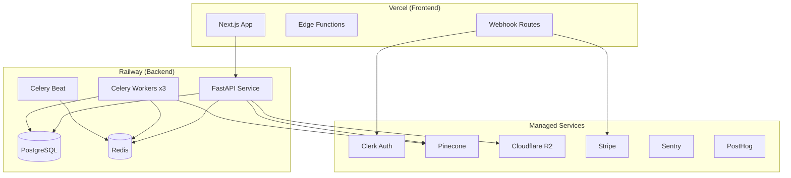

# ApplyPilot AI — Production Deployment Plan

---

## 1. Environment Strategy

| Environment | Purpose | URL | Deploy Trigger |
|-------------|---------|-----|----------------|
| Development | Local dev | localhost | Manual |
| Preview | PR previews | pr-{n}.applypilot.dev | PR open |
| Staging | Pre-prod testing | staging.applypilot.ai | Merge to `develop` |
| Production | Live users | app.applypilot.ai | Merge to `main` + manual approval |

---

## 2. Infrastructure Topology



---

## 3. Railway Configuration

```toml
# infra/railway/railway.toml

[build]
builder = "DOCKERFILE"
dockerfilePath = "infra/railway/Dockerfile"

[deploy]
healthcheckPath = "/health"
healthcheckTimeout = 30
restartPolicyType = "ON_FAILURE"
restartPolicyMaxRetries = 3

[[services]]
name = "api"
startCommand = "uvicorn app.main:app --host 0.0.0.0 --port $PORT --workers 4"

[[services]]
name = "worker"
startCommand = "celery -A app.workers.celery_app worker -l info -c 4 -Q critical,ai_generation,job_ingestion"

[[services]]
name = "beat"
startCommand = "celery -A app.workers.celery_app beat -l info"
```

```dockerfile
# infra/railway/Dockerfile
FROM python:3.12-slim

WORKDIR /app
RUN apt-get update && apt-get install -y libpq-dev gcc && rm -rf /var/lib/apt/lists/*

COPY backend/requirements.txt .
RUN pip install --no-cache-dir -r requirements.txt

COPY backend/app ./app
COPY prompts ./prompts

ENV PYTHONPATH=/app
EXPOSE 8000

CMD ["uvicorn", "app.main:app", "--host", "0.0.0.0", "--port", "8000"]
```

---

## 4. Vercel Configuration

```json
{
  "framework": "nextjs",
  "buildCommand": "npm run build",
  "outputDirectory": ".next",
  "regions": ["iad1"],
  "env": {
    "NEXT_PUBLIC_API_URL": "@api_url",
    "NEXT_PUBLIC_CLERK_PUBLISHABLE_KEY": "@clerk_publishable_key"
  },
  "headers": [
    {
      "source": "/(.*)",
      "headers": [
        { "key": "X-Frame-Options", "value": "DENY" },
        { "key": "X-Content-Type-Options", "value": "nosniff" },
        { "key": "Referrer-Policy", "value": "strict-origin-when-cross-origin" },
        { "key": "Permissions-Policy", "value": "camera=(), microphone=(), geolocation=()" }
      ]
    }
  ]
}
```

---

## 5. CI/CD Pipeline

```yaml
# .github/workflows/deploy.yml
name: Deploy

on:
  push:
    branches: [main, develop]

jobs:
  test-backend:
    runs-on: ubuntu-latest
    services:
      postgres:
        image: postgres:16
        env:
          POSTGRES_PASSWORD: test
        ports: ["5432:5432"]
    steps:
      - uses: actions/checkout@v4
      - uses: actions/setup-python@v5
        with: { python-version: "3.12" }
      - run: pip install -r backend/requirements.txt
      - run: pytest backend/tests -v
      - run: ruff check backend/
      - run: mypy backend/app --ignore-missing-imports

  test-frontend:
    runs-on: ubuntu-latest
    steps:
      - uses: actions/checkout@v4
      - uses: actions/setup-node@v4
        with: { node-version: "20" }
      - run: cd frontend && npm ci && npm run lint && npm run typecheck && npm run build

  deploy-staging:
    needs: [test-backend, test-frontend]
    if: github.ref == 'refs/heads/develop'
    runs-on: ubuntu-latest
    steps:
      - uses: actions/checkout@v4
      - uses: railwayapp/railway-deploy@v1
        with: { service: api, environment: staging }
      - uses: amondnet/vercel-action@v25
        with: { vercel-args: "--prod", scope: applypilot, alias-domains: staging.applypilot.ai }

  deploy-production:
    needs: [test-backend, test-frontend]
    if: github.ref == 'refs/heads/main'
    runs-on: ubuntu-latest
    environment: production  # Requires manual approval
    steps:
      - uses: actions/checkout@v4
      - run: cd backend && alembic upgrade head  # DB migrations
      - uses: railwayapp/railway-deploy@v1
        with: { service: api, environment: production }
      - uses: amondnet/vercel-action@v25
        with: { vercel-args: "--prod", scope: applypilot }
```

---

## 6. Database Migration Strategy

```bash
# Pre-deploy (automated in CI)
alembic upgrade head

# Rollback procedure
alembic downgrade -1

# Rules:
# 1. All migrations must be backward-compatible (no destructive DDL in single deploy)
# 2. Column drops: deprecate → stop writing → drop in next release
# 3. Large table migrations: use pg_repack or concurrent index creation
```

---

## 7. Deployment Checklist

### Pre-Deploy
- [ ] All tests passing on `main`
- [ ] Database migration reviewed and tested on staging
- [ ] Environment variables updated (if new)
- [ ] Prompt registry version pinned
- [ ] Feature flags configured (if partial rollout)

### Deploy
- [ ] Run database migrations
- [ ] Deploy backend (Railway rolling deploy)
- [ ] Deploy frontend (Vercel)
- [ ] Verify health checks pass
- [ ] Smoke test critical paths

### Post-Deploy
- [ ] Monitor Sentry for new errors (15 min)
- [ ] Check PostHog for traffic anomalies
- [ ] Verify Celery workers processing jobs
- [ ] Confirm Stripe webhooks receiving events
- [ ] Update status page (if scheduled maintenance)

---

## 8. Smoke Tests (Post-Deploy)

```bash
# Health check
curl -f https://api.applypilot.ai/health

# Auth flow
curl -f https://api.applypilot.ai/v1/auth/me -H "Authorization: Bearer $TEST_TOKEN"

# Job feed
curl -f "https://api.applypilot.ai/v1/jobs?page=1" -H "Authorization: Bearer $TEST_TOKEN"

# Celery worker alive
curl -f https://api.applypilot.ai/health/workers
```

---

## 9. Rollback Procedure

| Component | Rollback Method | RTO |
|-----------|----------------|-----|
| Frontend | Vercel instant rollback to previous deployment | 30 seconds |
| Backend | Railway rollback to previous deployment | 2 minutes |
| Database | `alembic downgrade -1` (if compatible) | 5 minutes |
| Prompts | Revert `registry.yaml` version + redeploy | 2 minutes |

**Decision criteria for rollback:**
- Error rate > 5% (Sentry)
- P99 latency > 5s
- Any data integrity issue
- Payment processing failure

---

## 10. Monitoring & Alerting

| Alert | Condition | Channel | Severity |
|-------|-----------|---------|----------|
| API down | Health check fails 3x | PagerDuty | P0 |
| Error spike | >50 errors/min | Slack #alerts | P1 |
| LLM failures | >10% agent failure rate | Slack #alerts | P1 |
| Queue backlog | >1000 pending tasks | Slack #alerts | P2 |
| DB connections | >80% pool utilization | Slack #infra | P2 |
| Stripe webhook fail | Any 5xx response | PagerDuty | P0 |

---

## 11. Domain & DNS Setup

```
applypilot.ai          → Vercel (landing + app)
app.applypilot.ai      → Vercel (dashboard)
api.applypilot.ai      → Railway (CNAME)
staging.applypilot.ai  → Vercel (staging)
docs.applypilot.ai     → GitBook (Phase 2)
status.applypilot.ai   → Instatus (Phase 2)
```

---

## 12. Secrets Management

| Secret | Storage | Rotation |
|--------|---------|----------|
| Database URL | Railway env | On credential change |
| API keys (OpenAI, etc.) | Railway env | Quarterly |
| Clerk secrets | Vercel + Railway env | On compromise |
| Stripe keys | Vercel + Railway env | Annual |
| Webhook secrets | Railway env | On regeneration |

**Never:** Commit secrets to git, log secrets, expose in frontend bundle (except publishable keys)

---

## 13. Launch Day Runbook

```
T-7 days:  Staging freeze, final QA pass
T-3 days:  Load test (100 concurrent users)
T-1 day:   Pre-warm Pinecone index, verify all job sources
T-0:       Deploy production at 9 AM ET (low traffic)
           Enable waitlist invites (100 users)
           Monitor for 4 hours
T+1 day:   Review metrics, expand to 200 users
T+7 days:  Retrospective, iterate
```
