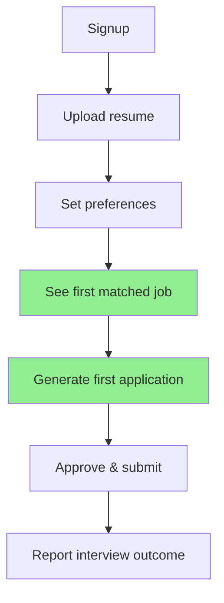

# ApplyPilot AI — Growth Strategy

**North Star:** Interview rate per approved application (target: 15%+)

---

## 1. Positioning

**Category:** Job Application Intelligence (not "auto-apply bot")

**One-liner:** "The AI that makes you a top 5% applicant — without sending a single application you haven't approved."

**Anti-positioning:** We are NOT LazyApply, Sonara, or AI job spam tools. We are the quality layer.

---

## 2. Target Customer Profile (ICP)

### Primary (MVP)
- Software engineers, 2-8 years experience
- Actively searching or open to opportunities
- US remote/hybrid preference
- Applying to 10-30 roles/month manually today
- Frustrated with low response rates (<5%)

### Secondary (Month 6+)
- Product managers, data scientists, designers
- International candidates targeting US roles
- Career switchers (bootcamp grads)

### Tertiary (Month 12+)
- Career centers / bootcamps (Teams tier)
- Outplacement firms (Enterprise)

---

## 3. Acquisition Channels

### 3.1 Content-Led Growth (Primary, CAC ~$5)

**Pillar content:**
- "Why your resume gets rejected in 6 seconds" (SEO: 12K/mo searches)
- "ATS keyword optimization guide 2026" (SEO: 8K/mo)
- "How top candidates actually apply" (LinkedIn viral potential)
- Weekly "Job Market Intelligence" reports (email list builder)

**Distribution:**
- Blog (applypilot.ai/blog) — 2 posts/week
- LinkedIn (founder + company) — daily posts
- YouTube shorts — resume before/after transformations
- Reddit (r/cscareerquestions, r/resumes) — genuine value, no spam

**Expected:** 5K organic visits/mo by Month 6 → 500 signups/mo

### 3.2 Product-Led Growth

**Viral loops:**
1. **Resume ATS Score (free tool)** — Upload resume → get score → signup for full analysis
2. **Match Score preview** — "See how you'd score for this job" (shareable link)
3. **Outcome badges** — "Got interview with ApplyPilot" (opt-in social proof)
4. **Referral program** — Give 1 month Pro, get 1 month Pro

**Free tier design:**
- 5 application packs/month (enough to taste value, not enough to satisfy)
- Full job matching (creates daily engagement habit)
- ATS score on every resume upload

**Expected conversion:** 8% free → Pro within 30 days

### 3.3 Community-Led Growth

- **Discord community:** Job search accountability groups
- **Weekly office hours:** Live resume reviews (founder-led)
- **Success stories:** Interview → offer case studies
- **Bootcamp partnerships:** Flatiron, Lambda School career services

### 3.4 Paid Acquisition (Month 6+, CAC target <$50)

| Channel | Budget/mo | Expected CPA |
|---------|-----------|-------------|
| Google Ads ("ATS resume checker") | $5K | $35 |
| LinkedIn Ads (SWE job seekers) | $3K | $55 |
| Twitter/X (tech audience) | $2K | $40 |
| Podcast sponsorships (tech careers) | $3K | $45 |

**Rule:** Only scale channel when LTV:CAC > 3:1 confirmed with 30-day cohort data

---

## 4. Activation & Retention

### Activation Funnel



**Activation milestone:** First matched job with score ≥ 75 (target: 60% of signups within 24h)

### Retention Hooks

| Hook | Mechanism | Frequency |
|------|-----------|-----------|
| New job matches | Email + push | Daily digest |
| Application follow-up | "It's been 7 days..." | Weekly |
| Market report | Role salary trends | Monthly |
| Interview prep | Triggered on status change | Event-driven |
| Streak | "5 days of active searching" | Daily |

**Target retention:** 40% D30, 25% D90

---

## 5. Pricing Psychology

```
Free     → "Try it"        → 5 apps/mo, basic matching
Pro $29  → "Serious search" → 50 apps/mo, all features  ← ANCHOR
Teams $79 → "Career coaches" → Multi-seat, shared boards
```

**Pricing tactics:**
- Annual plan: 2 months free ($290/year vs $348)
- "Cost of one coffee per application" framing
- Compare to career coach ($200/hr) or resume writer ($150)

---

## 6. Launch Sequence

### Pre-Launch (Weeks 8-11)
1. Landing page with waitlist (target: 2,000 emails)
2. Free ATS score tool (lead magnet)
3. 10 beta tester case studies
4. Product Hunt "Coming Soon" page

### Launch Week
1. Product Hunt launch (Tuesday)
2. Hacker News "Show HN" post
3. LinkedIn founder story post
4. Email waitlist (first 500 invites)
5. Reddit AMA in r/cscareerquestions

### Post-Launch (Month 1-3)
1. Weekly content publishing
2. Expand beta 100 → 500 → 2,000 users
3. Collect NPS + outcome data
4. Iterate on match quality based on interview rates

---

## 7. Growth Metrics Dashboard

| Metric | Week 4 | Month 3 | Month 6 | Month 12 |
|--------|--------|---------|---------|----------|
| Waitlist/signups | 500 | 5K | 15K | 50K |
| MAU | 200 | 2K | 8K | 30K |
| Paid subscribers | 20 | 200 | 800 | 3,000 |
| MRR | $580 | $5.8K | $23K | $87K |
| Interview rate | 10% | 12% | 15% | 15% |
| NPS | 30 | 40 | 45 | 50 |
| Organic traffic | 500/mo | 3K/mo | 10K/mo | 30K/mo |

---

## 8. Partnership Strategy

| Partner Type | Value Exchange | Timeline |
|-------------|---------------|----------|
| Bootcamps | Free Teams tier for graduates → we get users | Month 4 |
| Resume writers | White-label API → revenue share | Month 8 |
| Career coaches | Referral commission (20%) | Month 6 |
| LinkedIn creators | Sponsored content + affiliate | Month 3 |
| YC / startup job boards | Featured placement | Month 2 |

---

## 9. Competitive Moat via Growth

1. **Outcome data flywheel:** More users → more interview outcome data → better matching → more users
2. **Content SEO moat:** 200+ optimized articles by Month 12
3. **Community lock-in:** Discord + accountability partners
4. **Brand trust:** "The ethical AI job tool" positioning

---

## 10. Anti-Growth Guardrails

- Never optimize for application volume (optimize for interview rate)
- Never auto-submit (even if competitors do — this is our brand)
- Never buy email lists or scrape LinkedIn profiles for outreach
- Cap free tier to prevent abuse (5 apps/mo, not unlimited)
- Monitor for bot-like usage patterns; ban abusers
