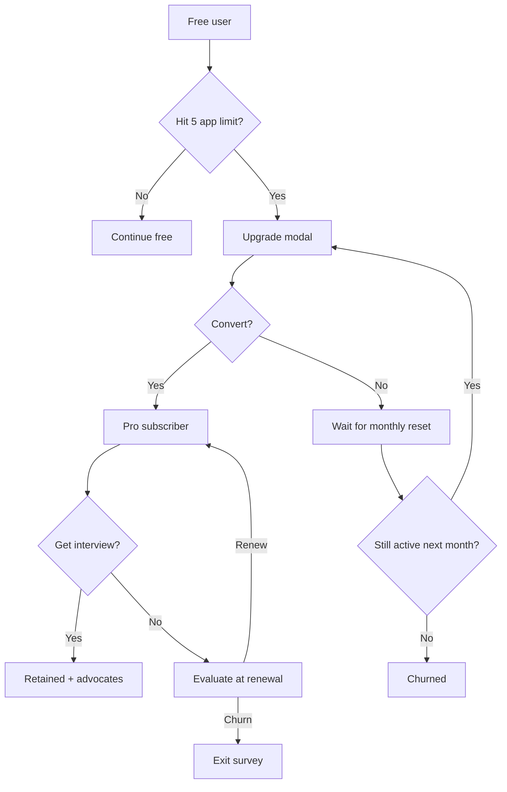

# ApplyPilot AI — Monetization Strategy

---

## 1. Pricing Tiers

### Free — "Explore"
**Price:** $0/month

| Feature | Limit |
|---------|-------|
| Job matching & discovery | Unlimited browsing |
| Match scores & gap analysis | 20 jobs/day |
| Application pack generation | 5/month |
| ATS resume score | Unlimited |
| Application tracker | 10 active |
| Interview coach | 1 session/month |
| Job sources | RemoteOK, YC, Indeed |

**Purpose:** Activation + habit formation. Enough to prove value, not enough for active searchers.

### Pro — "Active Search" ⭐ Primary Revenue
**Price:** $29/month ($290/year — 2 months free)

| Feature | Limit |
|---------|-------|
| Everything in Free | — |
| Application pack generation | 50/month |
| All job sources (8+) | ✅ |
| Outreach messages | ✅ |
| Interview coach | Unlimited |
| Market intelligence reports | 4/month |
| Priority job discovery | 6h → 3h cycle |
| Email digest | Daily |
| Export (PDF resume/tracker) | ✅ |

**Target:** Individual job seekers actively applying (10-30 apps/month)

### Teams — "Career Services"
**Price:** $79/seat/month ($790/seat/year)

| Feature | Limit |
|---------|-------|
| Everything in Pro | — |
| Application pack generation | 200/seat/month |
| Shared application boards | ✅ |
| Admin approval workflows | ✅ |
| Team analytics dashboard | ✅ |
| Bulk user management | ✅ |
| Priority support | ✅ |
| Custom branding (reports) | ✅ |

**Target:** Career coaches, bootcamp career services, outplacement firms (5-50 seats)

### Enterprise — "Organization" (Phase 2)
**Price:** Custom ($500-5,000/month)

- SSO (SAML)
- Dedicated account manager
- Custom integrations (ATS, HRIS)
- SLA guarantees
- Volume pricing
- API access

**Target:** University career centers, large outplacement firms, staffing agencies

---

## 2. Revenue Projections

| Month | MAU | Free | Pro | Teams | MRR | ARR |
|-------|-----|------|-----|-------|-----|-----|
| 3 | 2K | 1,840 | 150 | 10 seats | $5,140 | $62K |
| 6 | 8K | 7,360 | 560 | 80 seats | $22,560 | $271K |
| 12 | 30K | 27,600 | 2,160 | 240 seats | $81,600 | $979K |
| 18 | 60K | 55,200 | 4,320 | 480 seats | $163,200 | $2.0M |
| 24 | 100K | 92,000 | 7,200 | 800 seats | $271,600 | $3.3M |

**Assumptions:** 8% free→Pro conversion, 0.1% Teams adoption, 5% monthly churn on Pro

---

## 3. Additional Revenue Streams (Phase 2+)

### 3.1 Pay-Per-Use Add-ons
| Add-on | Price | Target |
|--------|-------|--------|
| Extra application packs (10) | $5 | Free users hitting limit |
| Premium market report | $9 | Non-subscribers |
| 1:1 AI mock interview (extended) | $15 | Pre-interview rush |
| Resume human review (partner) | $49 | Quality-conscious users |

**Expected:** 5% of Pro users purchase add-ons → +$1.50 ARPU

### 3.2 Affiliate Revenue
| Partner | Commission | Expected/mo at 30K MAU |
|---------|-----------|----------------------|
| Interview prep courses (Exponent, etc.) | 20-30% | $3K |
| Resume design tools (Canva Pro) | $5/signup | $1K |
| LinkedIn Premium referral | $20/signup | $2K |
| **Subtotal affiliate** | | **$6K/mo** |

### 3.3 API / White-Label (Enterprise)
- Career coach API: $0.10/application generated
- Bootcamp white-label: $5/student/month (min 100 students)
- Expected at Month 18: $10K/mo

---

## 4. Pricing Strategy Rationale

### Why $29/month for Pro
- **Anchor comparison:** LazyApply $99, Teal $29, career coach $200/hr
- **Unit economics:** $0.05-0.12/application pack cost → 91%+ gross margin
- **Psychology:** Less than Netflix, more than ChatGPT Plus — "serious tool" pricing
- **Willingness to pay research:** Job seekers spend $50-200/month during active search

### Why Free Tier Exists
- Product-led growth engine (PLG)
- Outcome data collection (even free users contribute match→outcome signals)
- SEO/content funnel entry point
- NOT a charity tier — deliberately constrained to drive conversion

### Why Not Usage-Based Pricing
- Job searching is emotionally charged — users want predictable costs
- Usage-based creates anxiety ("should I use my last credit on this job?")
- Flat subscription aligns incentives: we win when they get interviews, not when they generate more

---

## 5. Conversion Funnel Optimization

**Conversion triggers:**
1. Hit application limit (primary — 40% of conversions)
2. See high match score job they can't apply to (25%)
3. Daily digest with "3 new 90+ matches" (20%)
4. Interview coach limit (15%)

---

## 6. Retention & Expansion Revenue

### Pro → Teams Expansion
- Career coaches start as Pro → invite clients → need Teams
- Bootcamp grad becomes career coach → upgrades
- Expansion revenue target: 15% of Teams from Pro upgrades

### Annual Plan Push
- Offer at Month 3 of Pro subscription (proven value)
- Target: 30% of Pro on annual by Month 12
- Improves cash flow and reduces churn (annual churn ~15% vs monthly ~40%)

### Net Revenue Retention Target
| Metric | Month 6 | Month 12 | Month 24 |
|--------|---------|----------|----------|
| Gross churn | 8% | 5% | 4% |
| Expansion | 5% | 10% | 15% |
| **NRR** | **97%** | **105%** | **111%** |

---

## 7. Pricing Experiments (Post-Launch)

| Experiment | Hypothesis | Metric |
|-----------|-----------|--------|
| $24 vs $29 vs $39 Pro | Price elasticity | Conversion rate × ARPU |
| 3 vs 5 vs 10 free apps | Free tier optimization | Free→Pro conversion |
| Annual discount 15% vs 20% | Annual adoption | Annual plan % |
| Teams per-seat vs flat | Bootcamp pricing | Teams revenue |

**Rule:** Run pricing experiments on 10% traffic for 2 weeks minimum before rollout.

---

## 8. Revenue vs Cost Summary (at Scale)

| | Monthly |
|--|---------|
| **Revenue (100K MAU)** | $272,000 |
| LLM costs | $2,600 |
| Infrastructure | $2,700 |
| Payment processing (3%) | $8,160 |
| **Gross profit** | **$258,540 (95%)** |
| People + marketing | $362,500 |
| **Net** | **-$103,960** |

**Path to profitability:** 180K MAU or reduce people costs via automation + raise Pro to $39 at proven interview rates.

---

## 9. Fundraising Narrative

> "ApplyPilot has 95% gross margins on a $29/month subscription with proven 15% interview rates — 3-5x industry average. Our outcome data flywheel creates a compounding intelligence moat. At 100K MAU we generate $3.3M ARR with a clear path to profitability at 180K users."

**Key metrics for investors:**
- LTV:CAC > 5:1
- Gross margin > 90%
- NRR > 105%
- Interview rate 3-5x industry average
- Month-over-month growth > 15%
